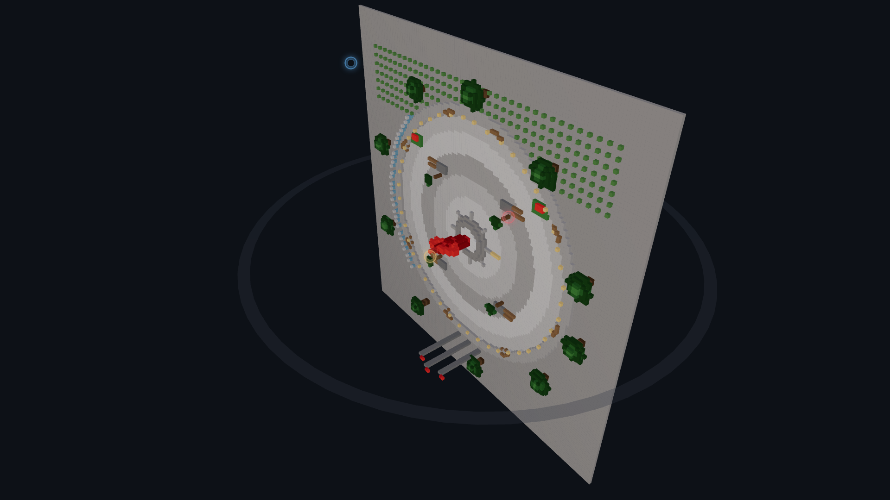
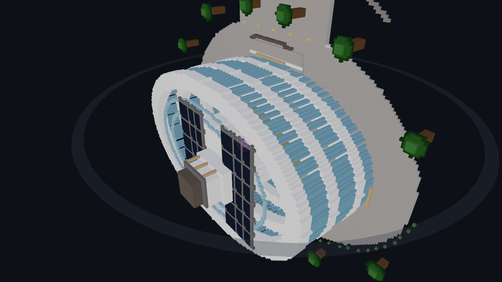
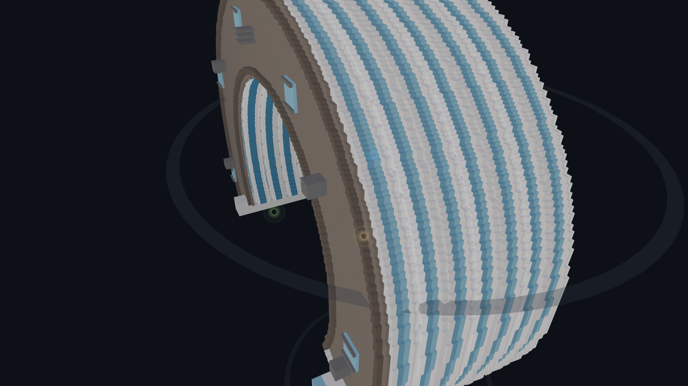
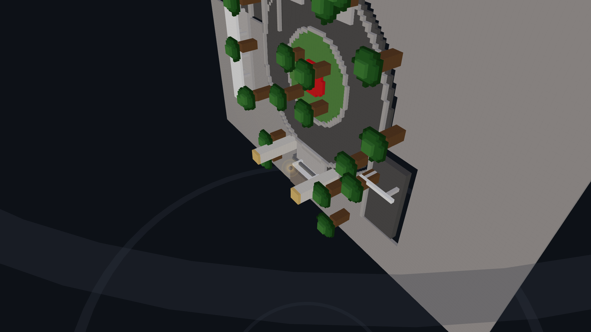
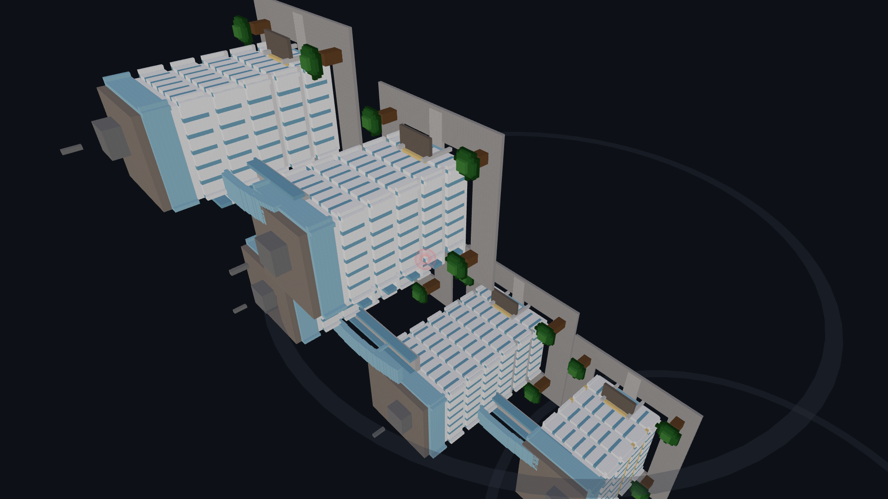
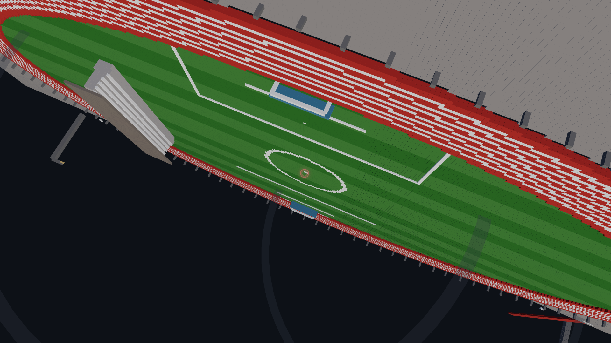

# 🧱 HKUST Voxel Campus · 香港科技大學體素校園

> A Minecraft-style 3D voxel model of the HKUST Clear Water Bay campus, rendered in the browser with Three.js. 3.15 million hand-crafted voxels at 0.5m resolution across 14 landmarks.

## 📸 Gallery

<div align="center">
  
  
</div>

<div align="center">
  
  
</div>

<div align="center">
  
  
</div>

<p align="center"><em>Red Bird Plaza · Shaw Auditorium · Academic Arc · North Gate · Student Halls · Track & Field</em></p>

## 🎥 Demo

Open `output/demo/viewer_voxel.html` in any modern browser, or serve locally:

```bash
cd output/demo
python3 -m http.server 8080
# → http://localhost:8080/viewer_voxel.html
```

## 🏛️ Landmarks

| # | Landmark | Voxels | Description |
|---|----------|--------|-------------|
| 1 | 🏛️ Academic Arc | 311,138 | 7-storey crescent-shaped main academic building |
| 2 | 🏃 Track & Field | 123,107 | 157m running track + soccer field + bleachers |
| 3 | 🎭 Shaw Auditorium | 92,206 | Henning Larsen's 3-ring elliptical landmark (2021) |
| 4 | 🏘️ Student Halls | 85,850 | 5 residence tower blocks |
| 5 | 🏗️ CYT Building | 66,599 | Cheng Yu Tung building with lecture pods |
| 6 | 📚 Library | 44,332 | 5-storey library embedded in Academic Arc |
| 7 | 🏢 LSK Building | 41,584 | Lee Shau Kee Business School |
| 8 | 🏛️ Atrium | 31,894 | Jockey Club Atrium — barrel-vaulted skylight |
| 9 | 🚪 North Gate | 30,073 | Stone pillars + roundabout + bus terminus |
| 10 | 🔴 Red Bird Plaza | 19,913 | Piazza with sundial sculpture + reflecting pool |
| 11 | 🏊 Pool | 18,518 | Olympic 50m pool + diving well + bleachers |
| 12 | 🏯 Chinese Garden | 2,684 | Pavilion + moon gate + lotus pond + bamboo |
| 13 | ⛲ Tianyi Spring | 837 | Fountain + seating wall + inscription stone |
| 14 | 🌊 Coastline | 2,400,223 | Terrain, ocean, beach, seawall |
| | **TOTAL** | **3,152,065** | |

## 🚀 Usage

### Prerequisites

```bash
pip install numpy
```

### Generate Voxel Models

```bash
# Individual landmark
python3 scripts/28_build_minecraft.py --landmark shaw
python3 scripts/28_build_minecraft.py --landmark plaza
python3 scripts/28_build_minecraft.py --landmark library
# ... (shaw, plaza, library, lsk, academic, atrium, cyt, halls,
#      track, pool, garden, spring, gate, coastline, campus)

# Full campus (all landmarks merged)
python3 scripts/28_build_minecraft.py --landmark campus

# All individual landmarks at once
for lm in shaw plaza library lsk academic atrium cyt halls track pool garden spring gate coastline; do
    python3 scripts/28_build_minecraft.py --landmark $lm
done
```

Output files are written to `output/demo/voxel_*.json`.

## 📁 Project Structure

```
HKUST_3D/
├── scripts/
│   ├── 28_build_minecraft.py    # ★ Main voxel generator (190 KB)
│   ├── 01-27_*.py               # Data pipeline scripts (CSDI, Google Earth, etc.)
│   └── *.sh                     # Shell runners
├── output/
│   ├── demo/
│   │   ├── viewer_voxel.html    # ★ 3D voxel viewer (Three.js)
│   │   ├── viewer.html           # GLB model viewer
│   │   └── voxel_*.json          # Generated voxel data
│   └── voxel/                    # Sample LDraw/Schematic exports
├── config/
│   └── api_keys.json.example     # API key template
├── README.md
├── Goal.md                       # Original technical plan (Chinese)
└── .gitignore
```

## 🎮 Viewer Controls

| Key | Action |
|-----|--------|
| `1`–`9`, `0`, `-`, `=` | Switch landmarks |
| `[` | Swimming Pool |
| `]` | Tianyi Spring |
| `W` `A` `S` `D` | Pan camera |
| `Q` `E` | Rotate |
| Scroll | Zoom |
| Drag | Orbit |

## 🎨 Color Palette

The campus uses 40+ named colors defined in `scripts/28_build_minecraft.py`:

- **Buildings**: shaw_white, champagne_bronze, bamboo_clad, glass_facetted
- **Plaza**: plaza_stone, sundial_gold, red_bird
- **Terrain**: hillside_grass, ground_gray, path_gray
- **Water**: water_blue, water_light, water_dark, deep_ocean
- **Vegetation**: tree_green, tree_dark, tree_bright, trunk_brown

## 📐 Technical Details

- **Voxel size**: 0.5m³ (PITCH = 0.5)
- **Coordinate system**: X=east-west, Y=north-south, Z=elevation (up)
- **Renderer**: Three.js 0.160 InstancedMesh with BoxGeometry
- **File format**: JSON `{pitch, count, bbox, positions, colors, categories}`
- **Deduplication**: Dict-based with first-writer-wins priority

## 📚 Data Sources

The original 3D reconstruction pipeline (scripts 01-27) obtained building geometry from:

| Source | Quality | Status |
|--------|---------|--------|
| HK CSDI (LandsD) | Photorealistic | ✅ Free API key |
| Google Earth | High | ⚠️ Research only |
| Google 3D Tiles | High | ⚠️ Research only |

See `Goal.md` for the full technical plan (Chinese).

## 📄 License

This project is for educational and research purposes. Building geometry derived from publicly available data. The HKUST name and Red Bird emblem are trademarks of HKUST.
